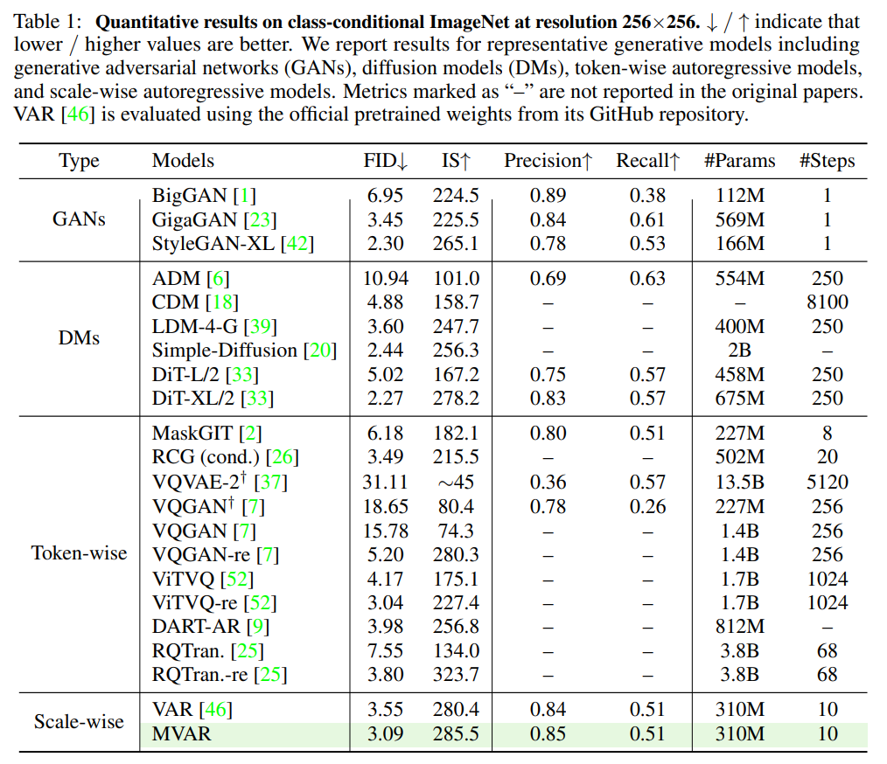

<div align="center">


<h2>
MVAR: Visual Autoregressive Modeling with Scale and Spatial Markovian Conditioning
</h2>

[Jinhua Zhang](https://scholar.google.com/citations?user=tyYxiXoAAAAJ),  [Wei Long](https://scholar.google.com/citations?user=CsVTBJoAAAAJ),  [Minghao Han](https://scholar.google.com/citations?hl=en&user=IqrXj74AAAAJ),  [Weiyi You](https://scholar.google.com/citations?user=q4uALoAAAAAJ),  [Shuhang Gu](https://scholar.google.com/citations?user=-kSTt40AAAAJ)

[](https://arxiv.org/abs/2505.12742)
[](https://github.com/LabShuHangGU/MVAR)

</div>
<!--
> **Abstract:**  Essential to visual generation is efficient modeling of visual data priors. Conventional next-token prediction methods define the process as learning the conditional probability distribution of successive tokens. Recently, next-scale prediction methods redefine the process to learn the distribution over multi-scale representations, significantly reducing generation latency. However, these methods condition each scale on all previous scales and require each token to consider all preceding tokens, exhibiting scale and spatial redundancy. To better model the distribution by mitigating redundancy, we propose Markovian Visual AutoRegressive modeling (MVAR), a novel autoregressive framework that introduces scale and spatial Markov assumptions to reduce the complexity of conditional probability modeling. Specifically, we introduce a scale-Markov trajectory that only takes as input the features of adjacent preceding scale for next-scale prediction, enabling the adoption of a parallel training strategy that significantly reduces GPU memory consumption. Furthermore, we propose spatial-Markov attention, which restricts the attention of each token to a localized neighborhood of size k at corresponding positions on adjacent scales, rather than attending to every token across these scales, for the pursuit of reduced modeling complexity. Building on these improvements, we reduce the computational complexity of attention calculation from O(N^2) to O(Nk), enabling training with just eight NVIDIA RTX 4090 GPUs and eliminating the need for KV cache during inference. Extensive experiments on ImageNet demonstrate that MVAR achieves comparable or superior performance with both small model trained from scratch and large fine-tuned models, while reducing the average GPU memory footprint by 3.0x.
-->

⭐If this work is helpful for you, please help star this repo. Thanks!🤗
 

## ✨ Key Contributions

1️⃣ **VAR exhibits scale and spatial redundancy, causing high GPU memory consumption.** 

<p align="center">
    
</p>

2️⃣ **The proposed method enables MVAR generation without relying on KV cache during inference.** 

<p align="center">
    
</p>

## 📑 Contents

- [📰 News](#news)
- [🛠️ Pipeline](#pipeline)
- [✅ Status](#status)
- [🥇 Results](#results)
- [📚 Citation](#citation)


## <a name="news"></a> 📰 News

- **2025-05-20:** Our MVAR paper has been published on arXiv.

## <a name="pipeline"></a> 🛠️ Pipeline

Our MVAR introduces the **scale and spatial Markovian assumpation** which only adopt adjacent preceding scale for next-scale prediction and restricts the attention of each token to a localized neighborhood of size k at corresponding positions on adjacent scales.

<p align="center">
    
</p>

## <a name="todo"></a> ✅ Status

- [x] 📄 Paper available on arXiv  
- [ ] 🧠 Codebase under preparation  
- [ ] 🚀 Planned improvements and model refinement


## <a name="results"></a> 🥇 Results

Our MVAR model achieves a **3.0× reduction** in GPU memory footprint compared to VAR. Detailed results can be found in the paper.

<details>
<summary>Comparison of Quantitative Results: MVAR vs. VAR (click to expand)</summary>

<p align="center">
  
</p>
</details>

<details>
<summary>Quantitative Results on the ImageNet 256×256 Benchmark (click to expand)</summary>

<p align="center">
  
</p>
</details>

<details>
<summary>Ablation Study on Scale and Spatial Markovian Assumptions (click to expand)</summary>

<p align="center">
  
</p>
</details>


## <a name="cite"></a> 🥰 Citation

Please cite us if our work is useful for your research.

```
@article{zhang2025mvar,
  title={MVAR: Visual Autoregressive Modeling with Scale and Spatial Markovian Conditioning},
  author={Zhang, Jinhua and Long, Wei and Han, Minghao and You, Weiyi and Gu, Shuhang},
  journal={arXiv preprint arXiv:2505.12742},
  year={2025}
}
```


## Contact

If you have any questions, feel free to approach me at jinhua.zjh@gmail.com
